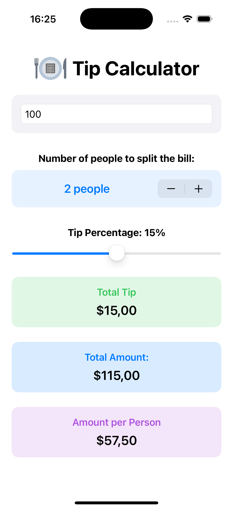
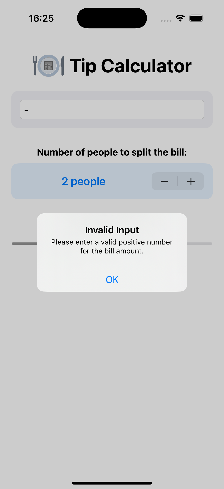

## About This Project

This is my **very first Swift project** that I created while learning Swift and SwiftUI. It’s a simple but practical Tip Calculator app that helped me understand fundamental concepts of iOS development such as:

- Using SwiftUI to build user interfaces declaratively
- Managing state with @State properties
- Handling user input with TextField and Stepper controls
- Implementing data validation and showing alerts
- Working with basic computations and updating the UI dynamically
- Understanding layout and styling with stacks, padding, colors, and modifiers
- Using ScrollView to ensure content fits on smaller screens
  
  

## Features

- Enter the bill amount
- Choose tip percentage with a slider (0% to 30%)
- Select number of people to split the bill using a stepper (1 to 20)
- Calculates total tip, total amount, and amount per person
- Validates input and shows alert for invalid entries

 

## Screenshots

<table>
<tr>
  <td></td>
  <td></td>
  <td></td>
</tr>
</table>

 

## How to Use

1. Enter the bill amount.
2. Adjust the tip percentage slider.
3. Choose how many people will split the bill.
4. See the calculated amounts update instantly.
 

## Requirements

- iOS 16 or later  
- Xcode 16 or later

